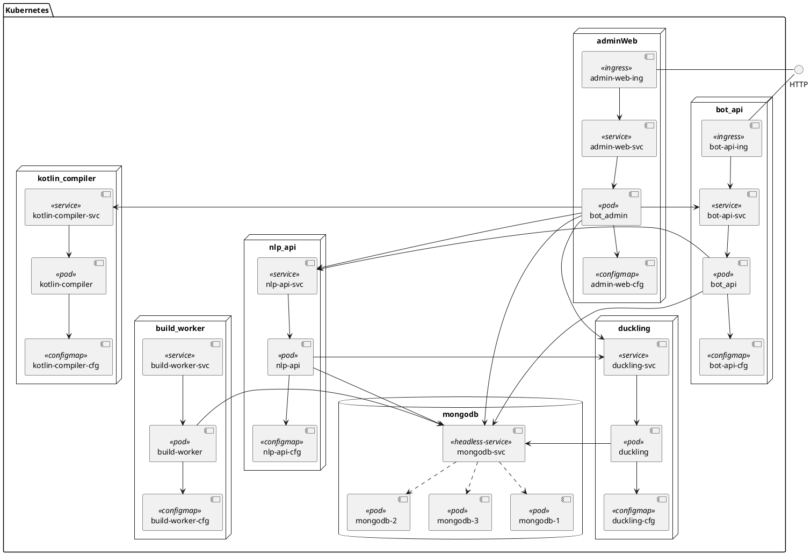

# Helm Chart for Tock  (theopenconversationkit)


[Tock](https://doc.tock.ai/fr/), an open conversational AI platform provide a complete solution to build conversational agents aka bots.

Tock can integrate and experiment with both classic and Generative AI (LLM, RAG) models.


## Quick start

```console 
$ helm install mytork ./charts/tock
```

You will find more information on chart parameters at the helm chart [README](charts/tock/README.md).

## What is deployed 

The chart deploy all tock components. It's able also to deploy a mongodb database (Bitnami mongoDb chart is used as subchart) or use an existing mongodb backend.


